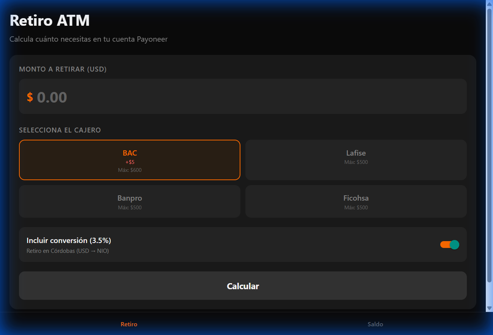
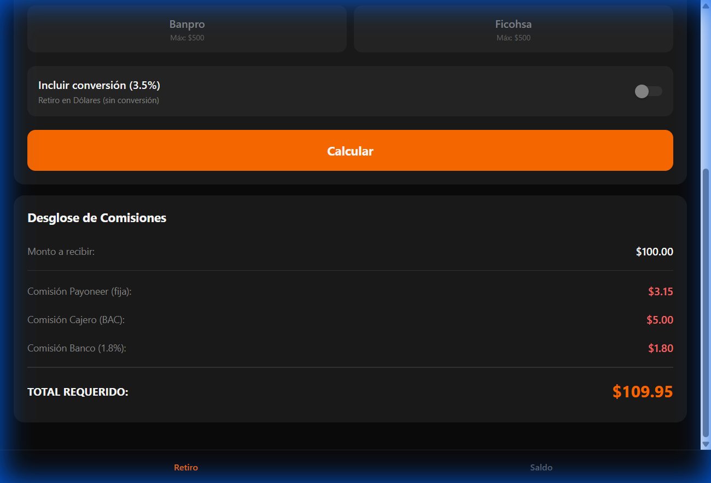
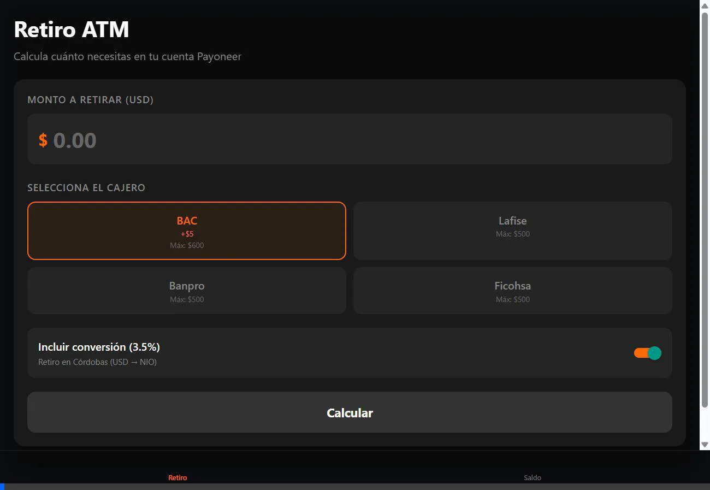

# Payoneer Fee Calculator

Calculadora de comisiones para retiros ATM de Payoneer en Nicaragua.

## Funcionalidades Principales

### 1. Toggle de Conversión (Nuevo)
Permite calcular con o sin la comisión de conversión (3.5%):
- **ON**: Retiro en Córdobas (USD → NIO) - incluye 3.5%
- **OFF**: Retiro en Dólares - sin conversión



### 2. Comparación Con/Sin Conversión

**Retiro $100 en BAC CON conversión:**
- Total requerido: **$113.45**

**Retiro $100 en BAC SIN conversión:**
- Total requerido: **$109.95**
- Ahorro: $3.50



---

## Límites de Retiro por Banco

| Banco | Fee Cajero | Máx/Retiro |
|-------|------------|------------|
| BAC | $5.00 | $600 |
| Lafise | $0 | $500 |
| Banpro | $0 | $500 |
| Ficohsa | $0 | $500 |

---

## Demo Completa



---

## Cómo Ejecutar

```bash
cd payoneer-fees-checker
npx expo start
```
